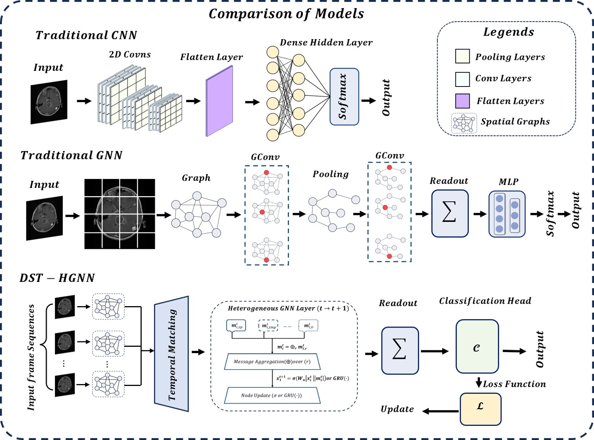

# DST-HGNN

**Dynamic Spatio-Temporal Hypergraph Networks for Cross-Anatomical Disease Modeling**

Official repository for the DST-HGNN framework.  
This work develops a dynamic heterogeneous hypergraph neural network for modeling longitudinal and multi-modal medical imaging data across anatomical domains.

---

## Overview

Conventional CNNs and static GNNs struggle to capture evolving spatio-temporal dependencies in medical imaging sequences (MRI, 4D-CT, endoscopy, retinal, dermatology). DST-HGNN addresses this by representing each patient scan sequence as an evolving heterogeneous hypergraph with multi-type nodes (voxels, landmarks, trajectories) and multi-relational edges (spatial, temporal, functional).

Key components include:
- Higher-order hypergraph convolutions
- EdgeGRU for irregularity-aware temporal propagation
- Causal attention gating
- Graph Information Bottleneck (GIB) for sparse, intrinsic explanations
- Decay-infused longitudinal encoder and dynamic pooling

The model achieves strong performance on multiple benchmarks while providing faithful node-level attributions without relying on post-hoc methods.

  

  <em>Figure: Overall architecture of DST-HGNN. Video/frame sequences are processed by a CNN backbone to extract feature grids. Nodes are constructed per time step, spatial graphs are built, temporal matching links nodes across frames, and multi-relational message passing with EdgeGRU updates produces the final representation.</em>

---

## Model Comparison

  

  <em>Comparison against traditional CNN and GNN pipelines. DST-HGNN explicitly models both spatial hypergraph structure and temporal dynamics via matching and EdgeGRU updates.</em>

---

## Key Features

- **Dynamic Heterogeneous Hypergraphs**: Multi-type nodes and multi-relational edges capture higher-order tissue interactions.
- **EdgeGRU + Causal Attention**: Handles irregular timestamps and evolves edge states over time.
- **Graph Information Bottleneck**: Produces sparse, faithful explanations (deformation trajectories, salient motifs).
- **Cross-Anatomical Generalization**: Trained primarily on brain MRI (BRISC 2025) and evaluated zero-shot / few-shot on endoscopy, retinal, ocular, and dermatology datasets.
- **Efficient Inference**: Designed for practical deployment (≈2 ms per 512×512 slice on modern GPUs in reported settings).

---

## Results Summary

**BRISC 2025 (Brain Tumor Classification)**  
- Accuracy: **96.85%**  
- F1-Score: **93.55%**  
- Outperforms ResNet50, EfficientNet-B2, ViT, and standard GCN baselines.

**Cross-Domain Generalization** (trained on BRISC 2025):

| Dataset              | Classes | Accuracy | AUC  |
|----------------------|---------|----------|------|
| GastroEndoNet        | 4       | 97.95%   | 0.99 |
| mBRSET (Retinal)     | 5       | 95.67%   | 0.99 |
| EyeDisease           | 5–10    | 92.65%   | 0.98 |
| SLICE-3D (Dermatology)| 6      | 93.35%   | 0.99 |

Full quantitative tables, ablation studies (EdgeGRU, contrastive pretraining, node/frame scaling), and training curves are available in the paper draft and associated notebooks.

---

## Repository Structure
DSTHGNN/
├── rsrc/
│   ├── dst hgnn arch.png          # Main architecture diagram
│   ├── dsthnncom.jpg              # Model comparison figure
│   └── note.md
├── attempts Notebooks/            # Experimental notebooks (Alzheimer/MRI runs, Kaggle GPU variants, iterative development)
│   ├── dst-hgnn-alzimer.ipynb
│   ├── dst-hgnn-kaggle-gpu.ipynb
│   ├── dst-hgnn-v1.ipynb
│   ├── dst-hgnn-v2.ipynb
│   └── dst-hgnn.ipynb
└── LICENSE                        # Apache 2.0

The notebooks contain the working implementations and experiments used during development. They are provided as research artifacts rather than production-ready packages.

---

## Citation & Discussion

Paper draft and related discussion:  
[OpenReview Forum](https://openreview.net/forum?id=beZwSyAqP2&noteId=qw8PhXBhf5)

If you find this work useful, please consider citing the associated manuscript (once formally published) or linking back to this repository.

---

## License

This project is released under the **Apache License 2.0**. See [LICENSE](LICENSE) for details.

---

## Acknowledgments

This repository contains research code and experimental artifacts developed for modeling dynamic medical imaging data with hypergraph neural networks. Feedback, issues, and extensions are welcome.
